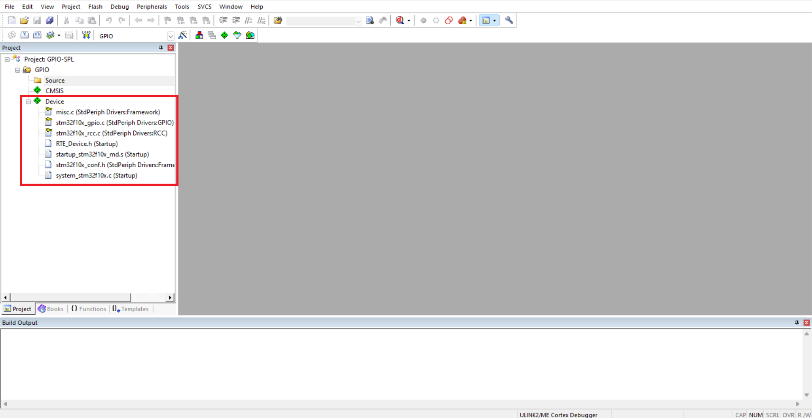

# LẬP TRÌNH GPIO SỬ DỤNG THANH GHI
## Giới thiệu lập trình sử dụng SPL
Để lập trình GPIO với SPL, cần sử dụng các gói sau:
- Framework: Khai báo sử dụng SPL trong dự án
- RCC: Điều khiển ngoại vi Control Clock của MCU
- GPIO: Điều khiển ngoại vi General Purpose Input Output 

Sau khi cấu hình xong, dự án có giao diện cơ bản như sau:

## Thử nghiệm
**Kết nối**:
- ***C13*** - LED 1
- ***B9*** - Button 1
- ***A0-A7*** - LED A (8 LED)
- ***A8-A15*** - Button A (8 Button)
- ***B0-B7*** - LED B (8 LED)

**Thử nghiệm**:
- Nhấn nút Button 1 và theo dõi hiện tượng ở LED 1
- Lần lượt hoặc nhấn đồng thời 1 số nút của Button A và xem hiện tượng ở LED A
- Theo dõi giá trị hiển thị trên LED B (Chú ý giá trị dưới dạng nhị phân)

**Giải thích:**
- Updating

**Mở rộng**:
- Hiệu chỉnh chương trình để tăng tốc độ đáp ứng từ khi nhấn nút đến khi đèn đáp ứng.
- Hiệu chỉnh chương trình đảo LED A thành A8-A15 và Button A thành A0-A7 sao cho việc sử dụng vẫn đáp ứng như cũ.
- LED B: Xây dựng hiệu ứng 1 đèn LED sáng chạy từ trái sang phải và ngược lại.